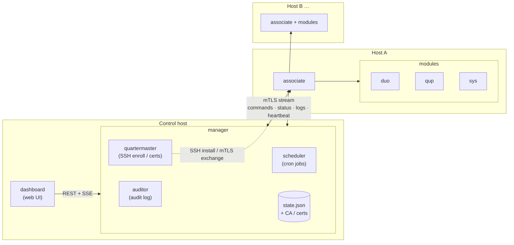

# LabAssistant

A lightweight dashboard + docker orchestrator + host updater + more. AI assisted, human designed and reviewed.

Ansible too complicated? PyInfra also too complicated? Portainer too bloated? LabAssistant is a lightweight replacement for some of those: a single pane of glass dashboard with the ability to orchestrate docker compose files, restart containers, update images, and edit those compose files directly on the host. While we're at it, it also notifies you of host package updates and applies them. See [DESIGN.md](DESIGN.md) for the full design and [API.md](API.md) for the module contract and manager API.

## Prerequisites

- **Go 1.26+** (only the manager build needs it; generated protobuf and dashboard assets are committed, so `buf` is **not** required to deploy)
- **tailscale** (optional — otherwise route/open ports between your hosts and the manager)

## Architecture



## Components

| Component | Role |
| --- | --- |
| **associate** | Per-host agent and sole entrypoint. Holds a persistent mTLS stream to the manager (status, heartbeat, log streaming), serializes commands in a queue, and elevates via a helper for privileged actions. |
| **manager** | The control host. Owns host/module state (`state.json`), the CA and issued certs, and the API the dashboard consumes. Derives liveness from the stream. |
| **dashboard** | Slim web UI (frontend for the manager API): host/container health, manual actions, add/remove hosts, scheduled tasks, compose-file editing with validation + undo, log streaming, audit view, backup/restore, and login. |

The manager has three internal packages:

- **quartermaster** — negotiates SSH to install/upgrade associates, does the mTLS cert exchange, and watches cert expiry.
- **auditor** — hash-chained, non-sensitive audit log (logins, host/module/cert changes, approvals) to file, SQLite, or external DB with configurable retention.
- **scheduler** — cron jobs across one or many hosts with skip/catch-up/retry policy, confirmation for destructive tasks, and manager- or host-timezone scheduling.

Full detail for each lives in [DESIGN.md](DESIGN.md#components).

## Modules

Modules are the abilities an associate runs on a host (contract in [API.md](API.md); compiled
into the associate for v1).

| Module | Purpose |
| --- | --- |
| **duo** | **d**ocker **u**pdater/**o**rchestrator — image update checks (Watchtower-style), compose start/stop/restart, docker log streaming. |
| **qup** | **q**uick **up**dater — dry-run + apply host package updates, distro-detected (Debian-based today). |
| **sys** | **sys**tem — host commands: logs, reboot (confirmed), interfaces, disk usage, uptime, service restarts. |

More detail in [DESIGN.md](DESIGN.md#modules).

## Quick deploy (dev VM)

To stand up a manager on a fresh Debian-based VM for development/testing, run the deploy script.
It clones the repo, installs Go if needed, and builds the manager:

```bash
# on the VM
curl -fsSL https://raw.githubusercontent.com/thinkaliker/LabAssistant/main/scripts/deploy.sh -o deploy.sh
bash deploy.sh
```

Or from an existing checkout: `./scripts/deploy.sh`. Options: `--dir <checkout>`,
`--branch <branch>`, `--home <data-home>`.

Then follow the printed next steps:

```bash
export LABASSISTANT_HOME="$HOME/.labassistant"
cd ~/LabAssistant
./bin/manager setpass     # set the dashboard login password
./bin/manager serve       # dashboard on :8080, associate mTLS on :8443
```

The deploy script installs a starter config at `$LABASSISTANT_HOME/config/config.toml` (copied
from [`config.sample.toml`](config.sample.toml); with the default home that's
`~/.labassistant/config/config.toml`). To serve the dashboard on a different port — e.g. when 8080
is already in use — edit `http_addr` there before `serve`:

```toml
http_addr = ":9090"
```

Unset fields keep their defaults, and the associate mTLS port (`grpc_addr`, `:8443`) is
independent, so enrolled hosts are unaffected. Deploying by hand instead of via the script? Just
create that file yourself — a missing config means all defaults.

Open the dashboard at `http://<vm>:8080` (or whichever `http_addr` you set). To enroll a host without the SSH flow, mint a bundle
with `./bin/manager enroll -name <host>` (see [BUILD.md](BUILD.md)).

## Workflow

1. Install and run the manager — it becomes your control host and root CA.
2. Open the dashboard and add a host (SSH user; flag tailscale).
3. The quartermaster SSHes in, installs the associate, and exchanges mTLS certs.
4. The associate runs as a service, dials home over mTLS, and advertises its modules.
5. Trigger actions from the dashboard → manager → associate → module.

Step-by-step setup is in [DESIGN.md](DESIGN.md#workflow-and-setup).

## TODO

Known items not yet designed into the components above.

### Associate / modules

- Modules are compiled into the associate for v1; design toward external-binary modules later
  (the contract is already shaped for it).

### Future work (post-v1)

- Associate self-update: push a new associate/helper binary over the stream and swap+restart it
  (chunked transfer, atomic replace, restart). Deferred from v1.
- ntfy integration
- Webhooks for external notification.
- Home Assistant integration.
- Expand coverage over time: qup → more distros; duo → swarm/podman.
- Multiple managers on different hosts can connect to an associate, but only one can perform
  operations at a time.
- Dockerize LabAssistant.
